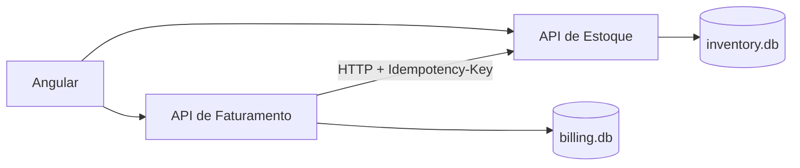

# Arquitetura e decisões técnicas

## Visão geral

A solução é composta por uma aplicação Angular e dois microsserviços ASP.NET Core. Cada serviço possui responsabilidades e persistência próprias:

- **Estoque:** cadastro de produtos, consulta de saldos e processamento de baixas;
- **Faturamento:** criação, numeração, consulta e fechamento de notas fiscais;
- **Frontend:** cadastro de produtos, composição de notas, acompanhamento do processamento e impressão.

O Faturamento não acessa diretamente o banco do Estoque. A baixa é solicitada por HTTP, preservando a independência entre os serviços.

## Organização do backend

As APIs estão separadas em camadas simples:

- `Domain`: entidades, estados e regras de negócio;
- `Application`: coordenação dos casos de uso;
- `Contracts`: modelos de entrada e saída da API;
- `Controllers`: exposição dos endpoints HTTP;
- `Infrastructure`: acesso ao banco e configurações do Entity Framework Core;
- `ErrorHandling`: conversão de exceções para respostas `ProblemDetails`.

As entidades protegem as regras fundamentais. Por exemplo, `Product.Debit` impede quantidades inválidas e saldo negativo, enquanto `Invoice.Close` impede que uma nota já fechada seja processada novamente.

## Persistência

Cada microsserviço utiliza um banco SQLite independente:

- `inventory.db`: produtos e operações de baixa já processadas;
- `billing.db`: notas fiscais e seus itens.

Os bancos são criados na inicialização com `EnsureCreatedAsync`. Os arquivos são dados locais de execução e não são versionados.

O código e a descrição do produto são armazenados também no item da nota como uma fotografia do momento da emissão. Dessa forma, uma alteração futura no cadastro do produto não modifica notas existentes.

## Fechamento da nota

Toda nota é criada com status `Open`. O fechamento segue esta sequência:

1. O Faturamento confirma que a nota ainda está aberta.
2. Solicita ao Estoque a baixa de todos os itens.
3. O Estoque valida os produtos e saldos.
4. As alterações de saldo são persistidas em uma única operação.
5. Após a confirmação, o Faturamento altera a nota para `Closed`.
6. O frontend atualiza os dados e abre a visualização de impressão.

Se a comunicação falhar ou não houver saldo, a nota permanece aberta e o erro é apresentado ao usuário. Isso permite corrigir o problema e repetir a operação.

## Idempotência e concorrência

O identificador da nota é enviado ao Estoque no cabeçalho `Idempotency-Key`. As chaves processadas são armazenadas em `StockOperations`; uma repetição retorna sucesso sem descontar o saldo novamente.

Os produtos possuem um token de concorrência otimista. Se duas requisições tentarem alterar uma versão já modificada, o conflito é identificado em vez de sobrescrever o saldo silenciosamente.

A numeração da nota é calculada no backend dentro de uma transação serializável e protegida por um índice único.

## Falhas e respostas HTTP

As APIs utilizam `ProblemDetails` para padronizar erros. Regras inválidas, recursos inexistentes, conflitos e indisponibilidade são convertidos nos respectivos códigos HTTP.

O cliente do Faturamento realiza retentativas com intervalos progressivos ao encontrar uma falha temporária no Estoque. A interface também oferece uma simulação controlada de indisponibilidade para demonstrar a recuperação do fluxo.

## Frontend

O Angular utiliza Reactive Forms para cadastro e composição das notas. Um `FormArray` permite incluir múltiplos produtos, enquanto operadores RxJS coordenam carregamentos e atualizações assíncronas.

A impressão possui um layout próprio para papel e somente é liberada depois que a nota é fechada com sucesso. Os indicadores de processamento evitam ações repetidas enquanto a operação está em andamento.

## Testes

Os testes automatizados cobrem regras de domínio e serviços de aplicação, incluindo:

- validação e normalização de produtos;
- saldo insuficiente e atomicidade da baixa;
- idempotência;
- criação e fechamento de notas;
- comportamento diante de falha do Estoque.

Os projetos de teste usam SQLite em memória para validar também o comportamento do Entity Framework Core sem criar arquivos permanentes.
