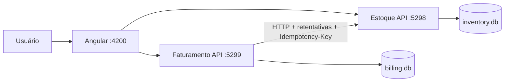

# Korp Fiscal - Teste Técnico

Sistema completo para cadastro de produtos, criação e impressão de notas fiscais, desenvolvido com Angular e dois microsserviços ASP.NET Core.

## Funcionalidades

- cadastro e consulta de produtos com código único, descrição e saldo;
- criação de notas com numeração sequencial, status inicial `Aberta` e múltiplos itens;
- impressão com indicador de processamento, fechamento da nota e baixa de estoque;
- bloqueio de impressão para notas já fechadas;
- persistência física independente em SQLite para Estoque e Faturamento;
- falha de Estoque simulável pela interface, feedback ao usuário e recuperação por nova tentativa;
- retentativas entre serviços, idempotência da baixa e controle otimista de concorrência;
- respostas de erro padronizadas com `ProblemDetails`;
- testes automatizados de domínio e aplicação.

## Arquitetura



Cada microsserviço é dono do seu banco. O Faturamento não acessa tabelas do Estoque: a comunicação ocorre somente pela API HTTP.

## Tecnologias

- .NET SDK 10.0.400, C# e ASP.NET Core;
- Entity Framework Core 10 e SQLite;
- Angular 21, Reactive Forms e RxJS 7;
- xUnit para testes;
- CSS responsivo próprio, sem biblioteca visual externa.

## Como executar

Pré-requisitos: .NET SDK 10, Node.js 24 e npm 11.

Na primeira execução, restaure as dependências:

```powershell
dotnet restore Korp.Teste.sln
cd frontend/korp-invoice-app
npm install
cd ../..
```

Abra três terminais na raiz do repositório.

Terminal 1 - Estoque:

```powershell
dotnet run --project src/Korp.Inventory.Api
```

Terminal 2 - Faturamento:

```powershell
dotnet run --project src/Korp.Billing.Api
```

Terminal 3 - Angular:

```powershell
cd frontend/korp-invoice-app
npm start
```

Acesse `http://localhost:4200`.

## Validação

```powershell
dotnet build Korp.Teste.sln
dotnet test Korp.Teste.sln

cd frontend/korp-invoice-app
npm run build
```

## Demonstração de falha e recuperação

1. Cadastre um produto com saldo 10.
2. Crie uma nota usando 2 unidades.
3. Clique em **Simular falha**.
4. Tente imprimir: após as retentativas, a tela informa o erro; a nota continua aberta e o saldo continua 10.
5. Clique em **Recuperar estoque** e imprima novamente.
6. A nota fica fechada, a impressão é aberta e o saldo passa para 8.

A chave idempotente é o identificador da nota. Portanto, mesmo que uma resposta entre os serviços seja perdida, repetir a operação não desconta o saldo novamente.

## Documentação técnica

As principais decisões de arquitetura, consistência e tratamento de falhas estão descritas em [ARQUITETURA.md](ARQUITETURA.md).

## Endpoints principais

| Serviço | Método e rota | Finalidade |
|---|---|---|
| Estoque | `POST /api/products` | Cadastrar produto |
| Estoque | `GET /api/products` | Listar produtos e saldos |
| Estoque | `POST /api/stock/debits` | Baixar estoque com `Idempotency-Key` |
| Estoque | `PUT /api/system/failure-simulation` | Ativar ou desativar falha demonstrável |
| Faturamento | `POST /api/invoices` | Criar nota aberta e sequencial |
| Faturamento | `GET /api/invoices` | Listar notas |
| Faturamento | `POST /api/invoices/{id}/close` | Baixar estoque e fechar a nota |
